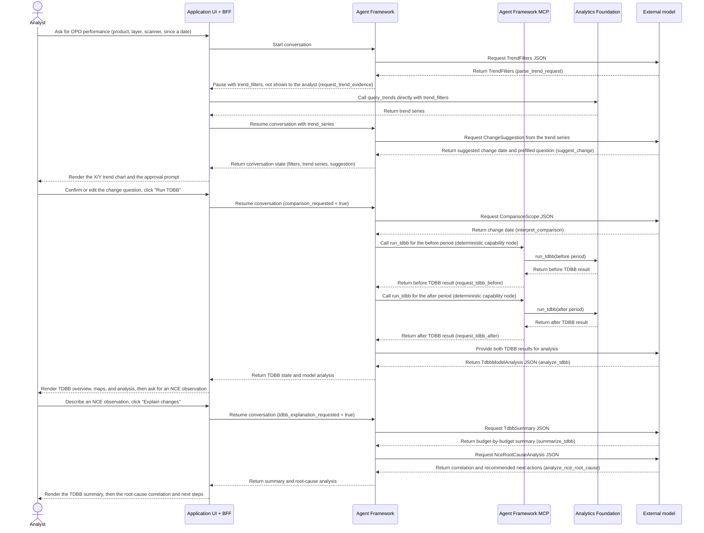

# OPO Monitoring v4: How the Workflow Works

## 1. Components

| Component | What it is | What it does | Never does |
|---|---|---|---|
| **Application** | OPO Monitoring browser UI + BFF | Transports chat requests, calls Analytics Foundation `query_trends` directly once the runtime has parsed `trend_filters`, and renders charts, tables, and messages from the returned conversation state | Call the model directly; execute agent workflows; own Foundation TDBB calculations |
| **Agent Framework** | Domain-neutral LangGraph runtime, model gateway, and governed MCP interface | Executes generic agent-definition nodes — model steps that call the model gateway, and deterministic capability steps that call governed MCP tools directly from workflow state — pauses for approvals (including handing `trend_filters` to the application), and persists state | Contain OPO rules, application logic, or Foundation data semantics; let the model choose when to query Foundation; call Foundation `query_trends` itself |
| **Model** | Language model | Turns text and the Foundation evidence already placed in workflow state into **JSON** matching a fixed schema | Read data independently, decide when to query Foundation, calculate raw deltas, draw |
| **Analytics Foundation** | Data platform | Trend queries (called directly by the Application) and TDBB processing (called through MCP by the Agent Framework) | Interpret or summarize |

In this workflow, `run_tdbb` is a **deterministic capability node** declared in the workflow graph, not a tool call the model chooses to make: it runs automatically, right after the preceding model step, using a request built from already-parsed state (`comparison_scope`). `query_trends`, by contrast, is resolved by the Application: the runtime pauses immediately after parsing `trend_filters` (an approval/interrupt node, `request_trend_evidence`), the BFF calls Analytics Foundation directly with those filters, and resumes the conversation with the resulting `trend_series` — this pause/resume is transparent to the analyst, never shown as an approval gate. The model never decides whether or when to fetch evidence in either case.

## 2. Analyst interaction (what the UI renders)

| Step | Analyst types or clicks in the UI | UI renders (from workflow state) |
|---|---|---|
| 1 | "Show OPO performance of product AAA2, layer OV_NO_ID2 on scanner GW021 since 17 Aug" | X and Y trend chart from Foundation data and a model-generated follow-up question when the evidence contains a clear step |
| 2 | Confirms or edits "I observe a jump from 1 Sep 2026 to 16 Sep 2026..." and clicks **Run TDBB** | TDBB overview grid, wafer/field maps and budget data from the two Foundation runs, plus the fingerprint, EExy and fingerprint-residual wafer maps |
| 3 | Types an NCE observation (e.g. "the wafer NCE in average gets bigger after 1 Sep") and clicks **Explain changes** | The model's evidence-grounded TDBB summary, followed by a correlation between the observation and the TDBB change with recommended next actions |

## 3. Flow and separation



There are three deployable entities: the Application (browser UI and BFF), the
domain-neutral Agent Framework (runtime, model gateway, and governed MCP), and
Analytics Foundation. External model providers are called through the Agent
Framework model gateway and are not part of the application deployment. The
agent definition owns OPO-specific prompts, schemas, routing, approvals, and
guardrails; the framework only executes those generic definition constructs.
The BFF calls the Agent Framework chat interface, and nothing in the Agent
Framework calls back into the BFF, except that the BFF itself calls Analytics
Foundation directly to resolve the `request_trend_evidence` pause. Within this
agent workflow, `run_tdbb` is declared as a deterministic capability node
(`workflow-definition.md` marks it `type: capability`): the framework calls it
directly, building the request from state already produced by the preceding
model step (`comparison_scope`). `query_trends` is declared as an approval/
interrupt node (`type: approval`) instead: the runtime pauses right after
`parse_trend_request` with `trend_filters` as the payload, the BFF calls
Analytics Foundation itself and resumes with `trend_series`, and the BFF
resolves this automatically (by `approval_id`) before it ever reaches the
analyst-facing UI. The model is never asked whether or when to fetch evidence
and never calls `query_trends` or `run_tdbb` itself; it only runs at the
`model`-type nodes that interpret the analyst's text or summarize the
evidence already placed in state. For TDBB, Analytics Foundation provides
`run_tdbb` for one requested period at a time, so the framework calls it twice
(before, then after) and the model analyzes the two returned results;
Foundation does not perform the comparison itself.

## 4. What is asked from the model and what it returns

The Application supplies the analyst question through the BFF. The Agent
Framework executes the v4 agent definition, builds model prompts, invokes the
model at each `model`-type node, separately executes `capability`-type nodes
by calling governed MCP tools directly from workflow state, and pauses at
`approval`-type nodes (including `request_trend_evidence`, which the BFF
resolves automatically rather than showing to the analyst). The model never
decides when to fetch Foundation evidence; it only receives whatever evidence
the framework has already placed in state by the time its node runs, and must
reply with JSON matching a declared schema. Foundation owns TDBB processing
and returns the numeric results for each requested run; the model interprets
the two results and analyzes their difference. Example exchanges from the
mock data run, in workflow order:

**1. (model, `parse_trend_request`): read filters** (prompt `trend_filters`, schema `TrendFilters`)
Example payload sent to the model:

```json
{
  "question": "Show OPO performance of product AAA2, layer OV_NO_ID2 on scanner GW021 since 17 Aug.",
  "conversation_context": {
    "available_trend_scopes": []
  }
}
```

Expected model response:

```json
{
  "lookback_days": null,
  "start_date": "2026-08-17",
  "end_date": "2026-09-16",
  "lot_ids": [],
  "product_ids": ["AAA2"],
  "layer_ids": ["OV_NO_ID2"],
  "exposure_equipment_ids": ["GW021"],
  "chuck_ids": [],
  "interpretation": "OPO performance of product AAA2, layer OV_NO_ID2 on scanner GW021 since 17 Aug.",
  "outliers_requested": false
}
```

**2. (application-resolved approval, `request_trend_evidence`): query trend data** (Foundation endpoint `query_trends`, called by the BFF)

This step only runs once `trend_filters` exists from step 1. The runtime
pauses with `trend_filters` as the interrupt payload — the model is not
involved and makes no request. The BFF detects this specific `approval_id`,
calls Analytics Foundation `query_trends` itself with those filters, and
resumes the conversation with the result, without ever surfacing it to the
analyst as an approval:

```json
{
  "start_date": "2026-08-17",
  "end_date": "2026-09-16",
  "product_ids": ["AAA2"],
  "layer_ids": ["OV_NO_ID2"],
  "exposure_equipment_ids": ["GW021"]
}
```

Foundation returns the trend series, which the BFF passes back to the runtime
as `trend_series` on resume. A following model step suggests a change date
from that evidence.

**3. (model, `suggest_change`): suggest a change date** (prompt `change_suggestion`, schema `ChangeSuggestion`)
Inputs are `trend_filters` and the `trend_series` evidence from step 2:

```json
{
  "change_date": "2026-09-01",
  "question": "I observe a jump from 1 Sep 2026. What changed in OPO?"
}
```

The application renders the trend chart together with this prefilled
follow-up question at the `request_comparison` approval gate. The analyst
confirms or edits it and clicks **Run TDBB**.

**4. (model, `interpret_comparison`): read change date** (prompt `comparison_scope`, schema `ComparisonScope`)
Example payload sent to the model:

```json
{
  "comparison_request": "I observe a jump from 1 Sep 2026 to 16 Sep 2026. I want to know what changed in OPO.",
  "trend_filters": {
    "start_date": "2026-08-17",
    "end_date": "2026-09-16",
    "product_ids": ["AAA2"],
    "layer_ids": ["OV_NO_ID2"],
    "exposure_equipment_ids": ["GW021"]
  },
  "change_suggestion": {
    "change_date": "2026-09-01"
  }
}
```

Expected model response:

```json
{
  "change_date": "2026-09-01",
  "interpretation": "The analyst observed a jump from 1 Sep 2026 and asks what changed in OPO."
}
```

**5. (deterministic capability, `request_tdbb_before` then `request_tdbb_after`): create before/after TDBB runs** (capabilities `processing.run_tdbb_before` / `processing.run_tdbb_after`, tool `run_tdbb`)

Once `comparison_scope.change_date` exists from step 4, the framework issues
two separate `run_tdbb` calls directly from state — approval for this
side-effecting operation was already granted at the `request_comparison`
gate (after step 3), so neither call asks the model or the analyst again:

Before-period request:

```json
{
  "start_date": "2026-08-17",
  "end_date": "2026-09-01",
  "change_date": "2026-09-01",
  "product_ids": ["AAA2"],
  "layer_ids": ["OV_NO_ID2"],
  "exposure_equipment_ids": ["GW021"]
}
```

After-period request:

```json
{
  "start_date": "2026-08-17",
  "end_date": "2026-09-16",
  "change_date": "2026-09-01",
  "product_ids": ["AAA2"],
  "layer_ids": ["OV_NO_ID2"],
  "exposure_equipment_ids": ["GW021"]
}
```

Each Foundation response contains the TDBB result (budgets plus wafer/field
maps) for that requested period only; Foundation does not perform a separate
comparison call.

**6. (model, `analyze_tdbb`): analyze the two runs** (prompt `tdbb_model_analysis`, schema `TdbbModelAnalysis`)
Inputs are `comparison_scope` and the budget/period data from both TDBB runs:

```json
{
  "message": "NCE - Wafer - Average is the largest mover, X 0.75 -> 1.52 nm (+103%); CE - Wafer - Average stayed roughly flat, so the change is non-correctable.",
  "largest_change": "NCE - Wafer - Average X +102.7% (0.75 -> 1.52 nm)",
  "limitations": ["TDBB localises the change; it does not establish its cause."]
}
```

The application renders the TDBB overview, budget bars, and fingerprint/EExy/
fingerprint-residual wafer maps as soon as this step completes, at the
`review_tdbb` approval gate. The analyst types an NCE observation and clicks
**Explain changes**.

**7. (model, `summarize_tdbb`): write a summary** (prompt `tdbb_summary`, schema `TdbbSummary`)
Example payload sent to the model:

```json
{
  "comparison_scope": {
    "change_date": "2026-09-01"
  },
  "tdbb_model_analysis": {
    "largest_change": "NCE - Wafer - Average X +102.7% (0.75 -> 1.52 nm)"
  },
  "before": {"periods": [{"budget": "nce_wafer.average", "x_m3s": 0.75}]},
  "after": {"periods": [{"budget": "nce_wafer.average", "x_m3s": 1.52}]}
}
```

Expected model response:

```json
{
  "message": "TDBB compared 17-31 Aug 2026 (30 lots, 240 wafers) with 1-16 Sep 2026 (32 lots, 256 wafers).\n- Average: NCE - Wafer X 0.75 -> 1.52 nm (+103%) ...\n- Chuck to chuck: ...\n- Lot to lot: ...\n- Wafer to wafer: ...",
  "largest_change": "NCE - Field - Average Y +159.1% (0.132 -> 0.342 nm)",
  "limitations": ["TDBB localises the change; it does not establish its cause."]
}
```

**8. (model, `analyze_nce_root_cause`): correlate the observation** (prompt `nce_root_cause_analysis`, schema `NceRootCauseAnalysis`)
Inputs are `comparison_scope`, the analyst's typed `root_cause_request`, and
the `radial_profile` bands from both TDBB runs:

```json
{
  "message": "nce_wafer.average rose sharply (0.75 -> 1.52 nm) while ce_wafer.average stayed flat, so the change is not an exposure-correction issue. The edge band's increase is proportionally larger than the center band's, so the residual growth concentrates near the wafer edge in the same window as the observed jump.",
  "correlated_evidence": ["nce_wafer.average X 0.75 -> 1.52 nm", "edge band m3s rose more than center band m3s"],
  "recommended_next_actions": [
    "Inspect the edge-weighted fingerprint/exposure process around 2026-09-01 for a bigger edge component.",
    "Set up a new control model that captures the edge-weighted residual pattern.",
    "Simulate that new control model in shadow mode before enabling it in production."
  ],
  "limitations": ["This is a temporal correlation, not a confirmed root cause."]
}
```

The agent definition supplies the date interpretation, approval, and evidence
guardrails. The UI renders the Foundation run results and the model's
interpretation; it does not calculate a canonical TDBB comparison.

## 5. What the model does not do

- No data access outside evidence already placed in state: all evidence the model sees comes from Analytics Foundation, fetched by either the BFF (`query_trends`) or the framework (`run_tdbb`).
- No independent data access or application-owned TDBB comparison: `run_tdbb` is a deterministic capability node the framework calls directly, and `query_trends` is resolved by the BFF at an application-facing pause; the model only analyzes evidence already in state, it never requests either.
- No rendering: every chart, table and message is drawn by the application UI.
- No final decisions: the application checks every date, and the analyst approves before TDBB runs.
- No root causes: the summary says where the change sits, not why.

## 6. Guardrails

- Every model answer must be JSON that fits a fixed schema (filters, change date, summary).
- Date interpretation, evidence references, and no-causality rules are authored in the v4 definition.
- Charts and TDBB tables come from Foundation data; explanatory text is grounded in the two returned runs.
- The UI shows TDBB results as soon as processing ends; the model summary is optional.

## 7. TDBB overview rendered by the application UI

|  | NCE - Wafer | NCE - Field | CE - Wafer | CE - Field | CE - Translation |
|---|---|---|---|---|---|
| **Average** | X / Y | X / Y | X / Y | X / Y | X / Y |
| **Chuck to chuck** | X / Y | X / Y | X / Y | X / Y | X / Y |
| **Lot to lot** | X / Y | X / Y | X / Y | X / Y | X / Y |
| **Wafer to wafer** | X / Y | X / Y | X / Y | X / Y | X / Y |

Each cell shows |mean| + 3sigma in nm, before vs after the change date. The
values come from Analytics Foundation TDBB processing, not from the model.

Example result on the mock data: NCE - Wafer - Average X rises from 0.75 to
1.52 nm (+103%), so the jump sits in non-correctable error.

## 8. NCE root-cause views

Fingerprint, EExy and fingerprint-residual wafer maps are rendered by the
application UI directly from the same before/after `run_tdbb` maps already
used for the TDBB overview (`ce_wafer.average`, `ce_field.average` and
`nce_wafer.average` respectively) - no separate model call or Foundation
endpoint. The model does not describe their contents.
