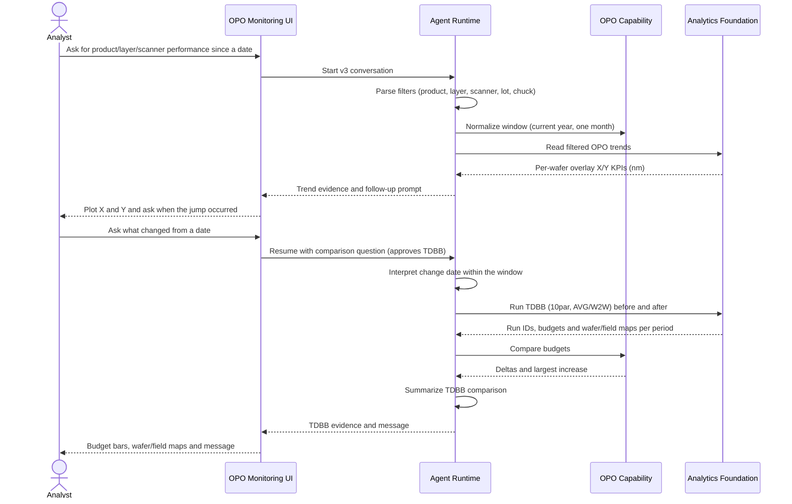

# OPO performance and TDBB follow-up

```mermaid
sequenceDiagram
    actor Analyst
    participant UI as OPO Monitoring UI
    participant Runtime as Agent Runtime
    participant OPO as OPO Capability
    participant Foundation as Analytics Foundation

    Analyst->>UI: Ask for product/layer/scanner performance since a date
    UI->>Runtime: Start v3 conversation
    Runtime->>Runtime: Parse filters (product, layer, scanner, lot, chuck)
    Runtime->>OPO: Normalize window (current year, one month)
    Runtime->>Foundation: Read filtered OPO trends
    Foundation-->>Runtime: Per-wafer overlay X/Y KPIs (nm)
    Runtime-->>UI: Trend evidence and follow-up prompt
    UI-->>Analyst: Plot X and Y and ask when the jump occurred
    Analyst->>UI: Ask what changed from a date
    UI->>Runtime: Resume with comparison question (approves TDBB)
    Runtime->>Runtime: Interpret change date within the window
    Runtime->>Foundation: Run TDBB (10par, AVG/W2W) before and after
    Foundation-->>Runtime: Run IDs, budgets and wafer/field maps per period
    Runtime->>OPO: Compare budgets
    OPO-->>Runtime: Deltas and largest increase
    Runtime->>Runtime: Summarize TDBB comparison
    Runtime-->>UI: TDBB evidence and message
    UI-->>Analyst: Budget bars, wafer/field maps and message
```

The comparison localises the change to TDBB budgets; it does not establish a
cause.
