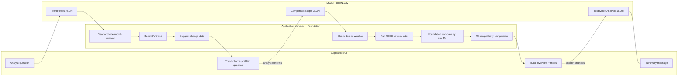

# OPO Monitoring v4: How the Workflow Works

## 1. Components

| Component | What it is | What it does | Never does |
|---|---|---|---|
| **Application UI** | OPO Monitoring browser app + BFF | Takes analyst input, renders all charts, tables and messages from workflow state | Call the model or compute budgets |
| **Agent runtime** | LangGraph workflow engine | Runs the steps in order, pauses for analyst decisions, keeps state | Render anything |
| **Model** | Language model | Turns text and supplied Foundation evidence into **JSON** matching a fixed schema | Read data independently, calculate raw deltas, draw, decide |
| **Application services** | OPO capability service | Deterministic rules: window, change-date suggestion and check, budget comparison | Interpret free text |
| **Analytics Foundation** | Data platform | Trend queries and TDBB processing | Interpret or summarize |

## 2. Analyst interaction (what the UI renders)

| Step | Analyst types or clicks in the UI | UI renders (from workflow state) |
|---|---|---|
| 1 | "Show OPO performance of product AAA2, layer OV_NO_ID2 on scanner GW021 since 17 Aug" | X and Y trend chart (from Foundation data) and a question box prefilled with the suggested change date (from the application) |
| 2 | Confirms or edits "I observe a jump from 1 Sep 2026 to 16 Sep 2026..." and clicks **Run TDBB** | TDBB overview grid, wafer/field maps and budget table (from Foundation and application data) |
| 3 | Clicks **Explain changes** | The model's summary text, shown as a message next to the application-computed headline |

## 3. Flow and separation



The agent runtime drives every arrow. The UI only renders what is in the
workflow state; the model only returns JSON into that state.

## 4. What is asked from the model and what it returns

The model gets a prompt and selected state as text, and must reply with JSON
matching a declared schema. Example responses from the mock data run:

**Call 1: read filters** (prompt `trend_filters`, schema `TrendFilters`)
Example payload sent to the model:

```json
{
  "question": "Show OPO performance of product AAA2, layer OV_NO_ID2 on scanner GW021 since 17 Aug.",
  "conversation_context": {
    "available_trend_scopes": []
  }
}
```

Expected model response:

```json
{
  "lookback_days": null,
  "start_date": "2026-08-17",
  "end_date": "2026-09-16",
  "lot_ids": [],
  "product_ids": ["AAA2"],
  "layer_ids": ["OV_NO_ID2"],
  "exposure_equipment_ids": ["GW021"],
  "chuck_ids": [],
  "interpretation": "OPO performance of product AAA2, layer OV_NO_ID2 on scanner GW021 since 17 Aug.",
  "outliers_requested": false
}
```

**Call 2: read change date** (prompt `comparison_scope`, schema `ComparisonScope`)
Example payload sent to the model:

```json
{
  "comparison_request": "I observe a jump from 1 Sep 2026 to 16 Sep 2026. I want to know what changed in OPO.",
  "trend_filters": {
    "start_date": "2026-08-17",
    "end_date": "2026-09-16",
    "product_ids": ["AAA2"],
    "layer_ids": ["OV_NO_ID2"],
    "exposure_equipment_ids": ["GW021"]
  }
}
```

Expected model response:

```json
{
  "change_date": "2026-09-01",
  "interpretation": "The analyst observed a jump from 1 Sep 2026 and asks what changed in OPO."
}
```

**Call 3: compare runs for model analysis** (tool `compare_tdbb_runs`)

The model receives the run IDs returned by `run_tdbb`; it does not receive raw
TDBB rows and does not calculate deltas. Foundation returns canonical
before/after summaries plus each budget's X/Y delta and percentage, the
largest increase and a headline. The model writes its structured analysis to
`tdbb_model_analysis`.

```json
{"before_run_ids":["run-LotOV1001","run-LotOV1002"],"after_run_ids":["run-LotOV1003","run-LotOV1004"]}
```

**Call 4: write summary** (prompt `tdbb_summary`, schema `TdbbSummary`)
Example payload sent to the model:

```json
{
  "comparison_scope": {
    "change_date": "2026-09-01"
  },
  "tdbb_comparison": {
    "headline": "NCE - Wafer average X increased from 0.75 to 1.52 nm.",
    "largest_increase": {
      "budget": "nce_wafer.average",
      "axis": "x",
      "before": 0.75,
      "after": 1.52,
      "relative_change_pct": 103.0
    }
  }
}
```

Expected model response:

```json
{
  "message": "TDBB compared 17-31 Aug 2026 (30 lots, 240 wafers) with 1-16 Sep 2026 (32 lots, 256 wafers).\n- Average: NCE - Wafer X 0.75 -> 1.52 nm (+103%) ...\n- Chuck to chuck: ...\n- Lot to lot: ...\n- Wafer to wafer: ...",
  "largest_change": "NCE - Field - Average Y +159.1% (0.132 -> 0.342 nm)",
  "limitations": ["TDBB localises the change; it does not establish its cause."]
}
```

The application checks or completes each JSON before it is used: dates from
calls 1 and 2 go through the year and window checks, and the UI shows the
Foundation comparison headline alongside the model's `largest_change`.

## 5. What the model does not do

- No data access: all data comes from Analytics Foundation.
- No calculations: windows and change-date validation are application code; Foundation computes the TDBB budget deltas.
- No rendering: every chart, table and message is drawn by the application UI.
- No final decisions: the application checks every date, and the analyst approves before TDBB runs.
- No root causes: the summary says where the change sits, not why.

## 6. Guardrails

- Every model answer must be JSON that fits a fixed schema (filters, change date, summary).
- A deterministic application step always follows a model step and corrects or rejects its dates.
- Charts, tables and the "largest increase" headline come from data, not from model text.
- The UI shows TDBB results as soon as processing ends; the model summary is optional.

## 7. TDBB overview rendered by the application UI

|  | NCE - Wafer | NCE - Field | CE - Wafer | CE - Field | CE - Translation |
|---|---|---|---|---|---|
| **Average** | X / Y | X / Y | X / Y | X / Y | X / Y |
| **Chuck to chuck** | X / Y | X / Y | X / Y | X / Y | X / Y |
| **Lot to lot** | X / Y | X / Y | X / Y | X / Y | X / Y |
| **Wafer to wafer** | X / Y | X / Y | X / Y | X / Y | X / Y |

Each cell shows |mean| + 3sigma in nm, before vs after the change date. The
values come from Analytics Foundation TDBB processing, not from the model.

Example result on the mock data: NCE - Wafer - Average X rises from 0.75 to
1.52 nm (+103%), so the jump sits in non-correctable error.

## 8. Next iteration

NCE root-cause views (fingerprint, EExy, fingerprint residuals) are
placeholders until their table schemas are defined.
