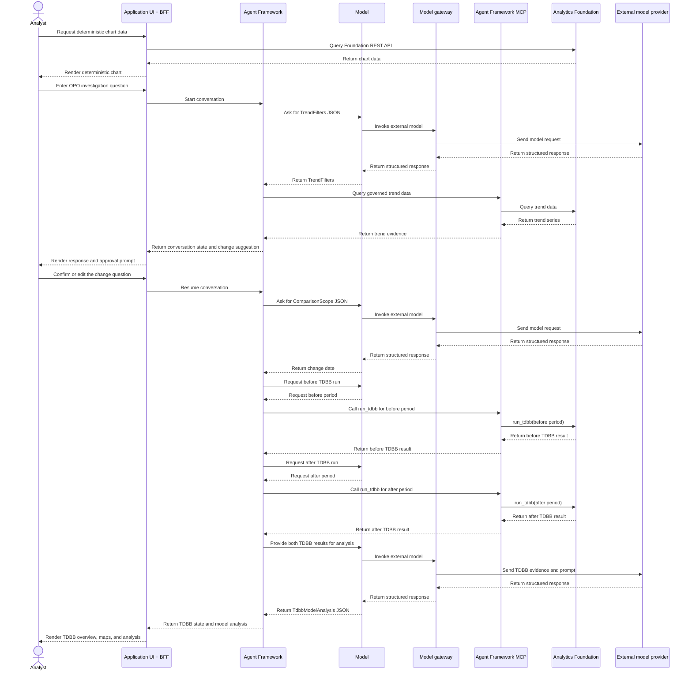

# OPO Monitoring v4: How the Workflow Works

## 1. Components

| Component | What it is | What it does | Never does |
|---|---|---|---|
| **Application** | OPO Monitoring browser UI + BFF | Transports chat requests, queries Foundation directly for deterministic chart data, and renders charts, tables, and messages | Call the model or MCP directly; execute agent workflows; own Foundation TDBB calculations |
| **Agent Framework** | Domain-neutral LangGraph runtime, model gateway, and governed MCP interface | Executes generic agent-definition nodes, pauses for decisions, persists state, calls external models through the gateway, and mediates model-to-MCP calls | Contain OPO rules, application logic, or Foundation data semantics |
| **Model** | Language model | Turns text and supplied Foundation evidence into **JSON** matching a fixed schema | Read data independently, calculate raw deltas, draw, decide |
| **Analytics Foundation** | Data platform | Trend queries and TDBB processing | Interpret or summarize |

## 2. Analyst interaction (what the UI renders)

| Step | Analyst types or clicks in the UI | UI renders (from workflow state) |
|---|---|---|
| 1 | "Show OPO performance of product AAA2, layer OV_NO_ID2 on scanner GW021 since 17 Aug" | X and Y trend chart (from Foundation data) and a question box prefilled with the suggested change date (from the application) |
| 2 | Confirms or edits "I observe a jump from 1 Sep 2026 to 16 Sep 2026..." and clicks **Run TDBB** | TDBB overview grid, wafer/field maps and budget table (from Foundation and application data) |
| 3 | Clicks **Explain changes** | The model's summary text, shown as a message next to the application-computed headline |

## 3. Flow and separation



There are three deployable entities: the Application (browser UI and BFF), the
domain-neutral Agent Framework (runtime, model gateway, and governed MCP), and
Analytics Foundation. External model providers are called through the Agent
Framework model gateway and are not part of the application deployment. The
agent definition owns OPO-specific prompts, schemas, routing, approvals, and
guardrails; the framework only executes those generic definition constructs.
The BFF calls the Agent Framework chat interface and nothing in the Agent
Framework calls back into the BFF. For deterministic chart rendering, the BFF
calls the Analytics Foundation REST API directly. For agent workflows, the
framework mediates model-to-MCP calls; MCP is not a separate application data
store. For TDBB, Analytics Foundation provides `run_tdbb` for one requested
period at a time. The model requests the before and after runs through MCP and
analyzes the two returned results.

## 4. What is asked from the model and what it returns

The Application supplies the analyst question through the BFF. The Agent
Framework executes the v4 agent definition, builds model prompts, invokes the
model, and mediates its read-only MCP calls. The model receives selected
workflow state and governed Foundation evidence, then must reply with JSON
matching a declared schema. Foundation owns TDBB processing and returns the
numeric results for each requested run; the model interprets the two results
and analyzes their difference. Example exchanges from the mock data run:

**Call 1: read filters** (prompt `trend_filters`, schema `TrendFilters`)
Example payload sent to the model:

```json
{
  "question": "Show OPO performance of product AAA2, layer OV_NO_ID2 on scanner GW021 since 17 Aug.",
  "conversation_context": {
    "available_trend_scopes": []
  }
}
```

Expected model response:

```json
{
  "lookback_days": null,
  "start_date": "2026-08-17",
  "end_date": "2026-09-16",
  "lot_ids": [],
  "product_ids": ["AAA2"],
  "layer_ids": ["OV_NO_ID2"],
  "exposure_equipment_ids": ["GW021"],
  "chuck_ids": [],
  "interpretation": "OPO performance of product AAA2, layer OV_NO_ID2 on scanner GW021 since 17 Aug.",
  "outliers_requested": false
}
```

**Call 2: read change date** (prompt `comparison_scope`, schema `ComparisonScope`)
Example payload sent to the model:

```json
{
  "comparison_request": "I observe a jump from 1 Sep 2026 to 16 Sep 2026. I want to know what changed in OPO.",
  "trend_filters": {
    "start_date": "2026-08-17",
    "end_date": "2026-09-16",
    "product_ids": ["AAA2"],
    "layer_ids": ["OV_NO_ID2"],
    "exposure_equipment_ids": ["GW021"]
  }
}
```

Expected model response:

```json
{
  "change_date": "2026-09-01",
  "interpretation": "The analyst observed a jump from 1 Sep 2026 and asks what changed in OPO."
}
```

**Call 3: create before/after TDBB runs for model analysis** (tool `run_tdbb`)

The Agent Framework mediates two model-to-MCP requests. The model asks MCP to
create one run for the before period and one run for the after period. Each
Foundation response contains the TDBB result for that requested period. The
model receives both governed results and analyzes the difference; Foundation
does not perform a separate comparison call.

Before-period request:

```json
{
  "start_date": "2026-08-17",
  "end_date": "2026-08-31",
  "change_date": "2026-08-31",
  "product_ids": ["AAA2"],
  "layer_ids": ["OV_NO_ID2"],
  "exposure_equipment_ids": ["GW021"]
}
```

After-period request:

```json
{
  "start_date": "2026-09-01",
  "end_date": "2026-09-16",
  "change_date": "2026-09-16",
  "product_ids": ["AAA2"],
  "layer_ids": ["OV_NO_ID2"],
  "exposure_equipment_ids": ["GW021"]
}
```

The model then returns `TdbbModelAnalysis` JSON in `tdbb_model_analysis`.

**Call 4: write summary** (prompt `tdbb_summary`, schema `TdbbSummary`)
Example payload sent to the model:

```json
{
  "comparison_scope": {
    "change_date": "2026-09-01"
  },
  "tdbb_comparison": {
    "headline": "NCE - Wafer average X increased from 0.75 to 1.52 nm.",
    "largest_increase": {
      "budget": "nce_wafer.average",
      "axis": "x",
      "before": 0.75,
      "after": 1.52,
      "relative_change_pct": 103.0
    }
  }
}
```

Expected model response:

```json
{
  "message": "TDBB compared 17-31 Aug 2026 (30 lots, 240 wafers) with 1-16 Sep 2026 (32 lots, 256 wafers).\n- Average: NCE - Wafer X 0.75 -> 1.52 nm (+103%) ...\n- Chuck to chuck: ...\n- Lot to lot: ...\n- Wafer to wafer: ...",
  "largest_change": "NCE - Field - Average Y +159.1% (0.132 -> 0.342 nm)",
  "limitations": ["TDBB localises the change; it does not establish its cause."]
}
```

The Application scope checks or completes each JSON before it is used: dates
from calls 1 and 2 go through the year and window checks, and the UI renders
the Foundation comparison headline alongside the model's `largest_change`.

## 5. What the model does not do

- No data access: all data comes from Analytics Foundation.
- No calculations: OPO window and change-date rules are declared by the agent definition and executed by generic framework constructs; the model analyzes the difference between the two Foundation TDBB results.
- No rendering: every chart, table and message is drawn by the application UI.
- No final decisions: the application checks every date, and the analyst approves before TDBB runs.
- No root causes: the summary says where the change sits, not why.

## 6. Guardrails

- Every model answer must be JSON that fits a fixed schema (filters, change date, summary).
- A deterministic application step always follows a model step and corrects or rejects its dates.
- Charts, tables and the "largest increase" headline come from data, not from model text.
- The UI shows TDBB results as soon as processing ends; the model summary is optional.

## 7. TDBB overview rendered by the application UI

|  | NCE - Wafer | NCE - Field | CE - Wafer | CE - Field | CE - Translation |
|---|---|---|---|---|---|
| **Average** | X / Y | X / Y | X / Y | X / Y | X / Y |
| **Chuck to chuck** | X / Y | X / Y | X / Y | X / Y | X / Y |
| **Lot to lot** | X / Y | X / Y | X / Y | X / Y | X / Y |
| **Wafer to wafer** | X / Y | X / Y | X / Y | X / Y | X / Y |

Each cell shows |mean| + 3sigma in nm, before vs after the change date. The
values come from Analytics Foundation TDBB processing, not from the model.

Example result on the mock data: NCE - Wafer - Average X rises from 0.75 to
1.52 nm (+103%), so the jump sits in non-correctable error.

## 8. Next iteration

NCE root-cause views (fingerprint, EExy, fingerprint residuals) are
placeholders until their table schemas are defined.
