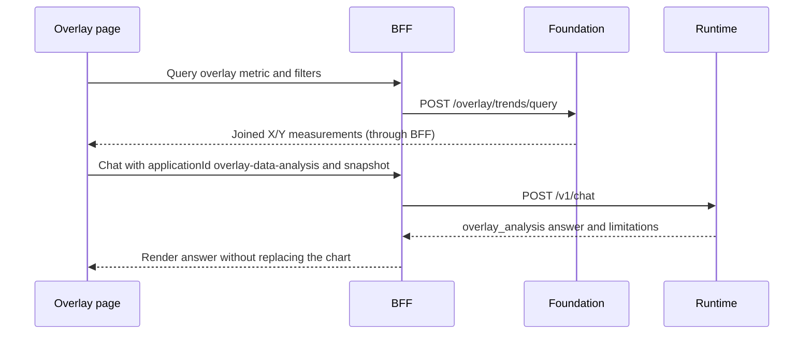

# Overlay Chat Flow

```mermaid
sequenceDiagram
    participant UI as Overlay page
    participant BFF
    participant Foundation
    participant Runtime
    UI->>BFF: Query overlay metric and filters
    BFF->>Foundation: POST /overlay/trends/query
    Foundation-->>UI: Joined X/Y measurements (through BFF)
    UI->>BFF: Chat with applicationId overlay-data-analysis and snapshot
    BFF->>Runtime: POST /v1/chat
    Runtime-->>BFF: overlay_analysis answer and limitations
    BFF-->>UI: Render answer without replacing the chart
```